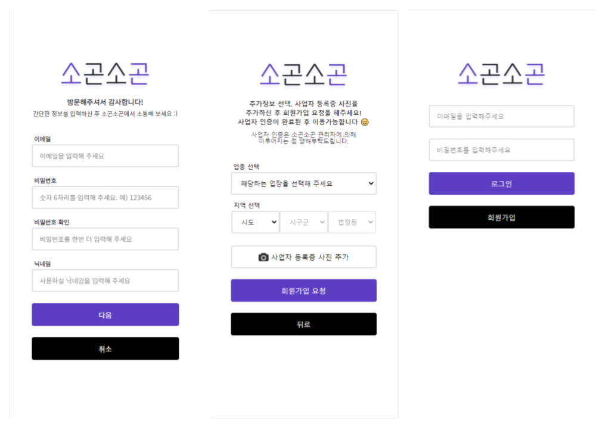
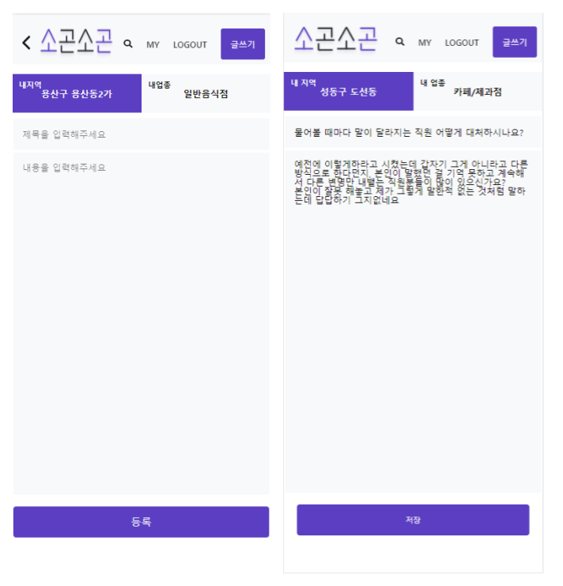

# 소상공인 커뮤니티 [소곤소곤]

- 2021 캡스톤 디자인 프로젝트 - 프론트 코드
- 본인의 지역 및 업종에 소속되어 해당 게시판에서만 소통 가능한 커뮤니티

## 🎨 Used

- gatsby
- react-reudx

## 💡 Main Function

### 1. 로그인/ 회원가입

### 2. 메인 게시판

- 내지역/ 내업종 선택 가능하며, 카테고리 내에서는 베스트 게시글과 전체 게시글로 구분됩니다.
- 우측 이미지는 전체 게시글의 더보기 클릭 시 화면입니다.
  

### 3. 게시글

- 게시글 확인과 댓글 생성이 가능합니다.
- 조회수, 공감수, 댓글수를 확인할 수 있습니다.
- 내가 쓴 게시글의 경우 수정/ 삭제 버튼이 활성화 됩니다.
  

### 4. 게시글 생성/ 수정

- 헤더의 글쓰기 버튼 클릭 시 게시글 생성이 가능합니다.
- 내가 쓴 게시글의 수정 버튼 클릭 시 게시글 수정이 가능합니다.
  

### 5. 마이페이지

- 헤더의 MY 버튼 클릭 시 정보 수정 및 활동 내역 확인이 가능합니다.
  

### 6. 검색

- 헤더의 돋보기 클릭 시 제목을 통한 검색이 가능합니다.
- 우측 이미지는 `요`를 입력했을 때 검색 결과입니다.
  

## 🎬 Demo

